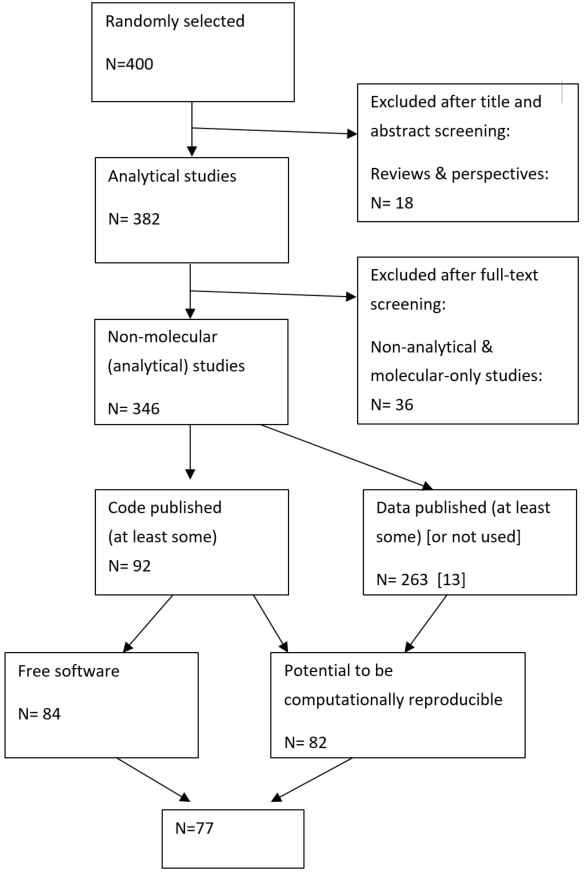

```{r,echo=FALSE, cache=FALSE}
## numbers >= 10^5 will be denoted in scientific notation, and rounded to 2 digits
options(digits=3)
```

```{r setup, echo = FALSE, eval = TRUE}
rm(list=ls())
knitr::opts_chunk$set(echo = TRUE, warning = FALSE, eval = TRUE)
pacman::p_load(openxlsx,dplyr,ggplot2,tidyverse,pander,ggpubr,knitr,kableExtra)

# importing datasets
data.full <- read.table("data/code_availability_full_and_clean.csv",header=TRUE,sep=",")
journal.policies <- read.xlsx("data/Updated_Table_Mislan_2020_v2.xlsx",colNames=T,sheet=1)

# Coder's information: 
# Alfredo Sanchez-Tojar (@ASanchez_Tojar)
# Profile: https://goo.gl/PmpPEB
# Department of Evolutionary Biology, Bielefeld University (GER) 
# Email: alfredo.tojar@gmail.com
# Script first created on the 2nd of April 2020
```

## 1 - Methods

### 1.1 - State of analytical code in ecology

We randomly sampled articles published in ecological journals for which code-sharing has been either mandatory or encouraged since June 2015 at the latest. Sampling within these journals maximizes the code available for quality assessment (see below), and also helps us to understand where other ecological journals will likely be in the near future, as code archiving policies proliferate [@stodden2013]. The sample of journals was obtained from Mislan et al. [-@mislan2016], who identified `r table(journal.policies$Require.computer.code.with.publication_2015)['Yes']` out of `r nrow(journal.policies)` (`r round((table(journal.policies$Require.computer.code.with.publication_2015)['Yes']/nrow(journal.policies))*100,0)`%) ecological journals with mandatory or encouraging code-sharing policies in place since at least the 1st of June 2015 (Table S3). We sampled all the articles published in these `r table(journal.policies$Require.computer.code.with.publication_2015)['Yes']` journals using the Web of Science Core Collection (search performed at the Netherlands Institute of Ecology) for two distinct temporal periods: 1st of June 2015 to 9th of December 2016 (2015/16 dataset, N= 4,366 records), and 1st of January 2018 to 21st of May 2019 (2018/19 dataset, N=4,291). A random sample of 200 articles from each period was then selected using the function “sample” in R v. 3.3.2 [R Core Team -@rcoreteam2018].

For each of the 400 articles, we determined whether the article was relevant to our survey by screening all titles and abstracts using the software Rayyan [@ouzzani2016]. Reviews, opinion pieces, and commentaries were excluded, whereas articles that conducted some kind of statistical analysis and/or simulations were kept for further screening. All the articles were double screened at this stage (2015/16 by AC and IvB; and 2018/19 by AST and SE). As a result, `r table(data.full[data.full$Publication_year.2=='2015-2016','Excluded.abstract.screening'])["no"]` of the `r nrow(data.full[data.full$Publication_year.2=='2015-2016',])` articles in 2015/16 dataset, and `r table(data.full[data.full$Publication_year.2=='2018-2019','Excluded.abstract.screening'])["no"]` of the `r nrow(data.full[data.full$Publication_year.2=='2018-2019',])` articles in 2018/19 dataset were kept for further evaluation. The full list of these articles, with the results of the screening is provided (see file `data/code_availability_full_and_clean.csv`).

In the next steps (summarized in Figure S1) AC evaluated `r table(data.full[data.full$Publication_year.2=='2015-2016','Excluded.abstract.screening'])["no"]` articles from 2015/16, and AST evaluated `r table(data.full[data.full$Publication_year.2=='2018-2019','Excluded.abstract.screening'])["no"]` articles from 2018/19. First, each article was read in detail to determine if it was a purely bioinformatical (i.e. molecular) study with solely bioinformatical analyses. Only studies that conducted at least some statistical analyses other than bioinformatics (including simulations) were considered further (hereafter referred to as 'non-molecular'). These non-molecular articles (`r table(data.full[data.full$Publication_year.2=='2015-2016','statistical.analysis.and.or.simulations.2'])["yes"]` in 2015/16; `r table(data.full[data.full$Publication_year.2=='2018-2019','statistical.analysis.and.or.simulations.2'])["yes"]` in 2018/19) were then evaluated based on the following (and as shown in Figure S1):

1)	Was the analytical code published? (‘yes’, ‘no’, ‘some’). This was done by checking both the article’s main text, data accessibly statements, and the supplementary materials, including archived data, if any. If no code (‘code’, ‘script’, ‘syntax’) was mentioned in any of these sections, then all links to archived data, and all supplementary materials were searched. 

2)	What software was used in the analysis? (e.g. R, Python, SAS...)

3)	Were there data used in the analysis (‘yes’, ‘no’)? If yes, were the data published (‘yes’, ‘no’, ‘some’)?

For those articles that had published seemingly all or at least some of their code (`r table(data.full[data.full$Publication_year.2=='2015-2016','CodePublished.3'])["yes"]` in 2015/16; `r table(data.full[data.full$Publication_year.2=='2018-2019','CodePublished.3'])["yes"]` in 2018/19), we evaluated the following:

4)	Where was the code published (‘repository’, ‘supplementary material’, 'version control platform', ‘webpage’)?

5)	Was the existence of code clearly mentioned (‘yes’, ‘no’), and if so, how (‘code’, ‘script’, ‘other’)?

6)	Where was the reference to the code made, if at all (‘methods section’, ‘data accessibility statement’, ‘supplementary material’, ‘other’)?

7)	Did the code include some kind of documentation such as README or HowTo files (‘yes’, ‘no’ or ‘with some comments’)?

8)	Were there inline comments within the code (‘yes’, ‘no’)?

<center>



</center>

To ensure data reliability, we randomly selected and double-checked data extraction (two observers: AST and AC) for `r round((nrow(data.full[(data.full$Second_screener=="AST" | data.full$Second_screener=="AC") & !(is.na(data.full$Second_screener)),])/table(data.full$Excluded.abstract.screening)["no"])*100,0)`% of all the articles that had passed the title-and-abstract screening (`r nrow(data.full[data.full$Second_screener=="AST" & !(is.na(data.full$Second_screener)),])` out of `r table(data.full[data.full$Publication_year.2=='2015-2016','Excluded.abstract.screening'])["no"]` articles from 2015/16, and `r nrow(data.full[data.full$Second_screener=="AC" & !(is.na(data.full$Second_screener)),])` out of `r table(data.full[data.full$Publication_year.2=='2018-2019','Excluded.abstract.screening'])["no"]` from 2018/19 dataset). The decision overlap between observers was very high (please see file `data/code_availability_full_and_clean.csv` for changes and explanations made to the table after the double screening). Some additional articles were further intentionally double-checked whenever the original screener was not sure about the assignment of some scores (`r nrow(data.full[(data.full$Second_screener=="AST-quick" | data.full$Second_screener=="AC-quick") & !(is.na(data.full$Second_screener)),])` articles) or when the original screener could not find any reference to the software used for the analyses (`r nrow(data.full[data.full$Stat_analysis_software=="Not Stated" & !(is.na(data.full$Stat_analysis_software)),])` articles; more details in file `data/code_availability_full_and_clean.csv`).

### 1.2 - Journals' code-sharing policies

We explored if the number of ecological journals with code-sharing policies has increased since 2015, when only `r table(journal.policies$Require.computer.code.with.publication_2015)['Yes']` out of `r nrow(journal.policies)` (`r round((table(journal.policies$Require.computer.code.with.publication_2015)['Yes']/nrow(journal.policies))*100,0)`%) had code-sharing policies [@mislan2016]. In March 2020 we investigated the code-sharing policies for all the `r nrow(journal.policies)` ecological journals identified by Mislan et al. [-@mislan2016; Table S3]. One observer (AC) read the 'Authors Instructions' and 'Editorial Policies' of each journal, and a second observer (AST) did so but only for the `r table(journal.policies$Require.computer.code.with.publication_2015)['Yes']` journals reviewed in this study and for those journals scored as 'No' (see below) by the first observer - unclear cases were discussed together. If none of these sections explicitly mentioned data and/or code, we also checked other sections of the journal's website, whenever possible. Based on the information collected, we scored the journals' code-sharing policies as: ‘encouraged’ (publication of the code is explicitly encouraged, but not required), ‘mandatory’ (code must be published together with the article), or 'encouraged/mandatory' (when the wording made it difficult to judge if code publication is encouraged or required). If a journal did not explicitly encourage code-sharing (i.e. even when it mentioned research artefacts, but not 'code' or 'script' explicitly: `r nrow(journal.policies[journal.policies$Require.computer.code.with.publication_2020=="No" & !(is.na(journal.policies$Require.computer.code.with.publication_2020)) & !(is.na(journal.policies$Comment_on_2020)),])` out of `r nrow(journal.policies[!(is.na(journal.policies$Require.computer.code.with.publication_2020)),])`, `r round((nrow(journal.policies[journal.policies$Require.computer.code.with.publication_2020=="No" & !(is.na(journal.policies$Require.computer.code.with.publication_2020)) & !(is.na(journal.policies$Comment_on_2020)),])/nrow(journal.policies[!(is.na(journal.policies$Require.computer.code.with.publication_2020)),]))*100,0)`%), the journal's code-sharing policy was scored as ‘No’ (i.e. code-sharing is not mentioned explicitly; see comments in file `data/Updated_Table_Mislan_2020_v2.xlsx`).

**Table S1**. List of `r nrow(journal.policies)` ecological journals and their code-sharing policies in June 2015 [@mislan2016] and in March 2020 (this study).
```{r}
# printing Table S1
journal.policies %>% select(Full.Journal.Title,Require.computer.code.with.publication_2015,Require.computer.code.with.publication_2020) %>%
  rename(Journal=Full.Journal.Title,'Code-sharing policy 2015'=Require.computer.code.with.publication_2015,'Code-sharing policy 2020'=Require.computer.code.with.publication_2020) %>% arrange(Journal) %>%
  kable("html") %>% kable_styling() %>%
  scroll_box(width = "100%", height = "500px")
```

## 2 - Results

### 2.1 - Percentages calculations

```{r}
# number of eligible articles
eligible.articles.code <- as.numeric(data.full %>% 
                                       filter(!(is.na(statistical.analysis.and.or.simulations.2))) %>% 
                                       summarise(eligible_articles = sum(statistical.analysis.and.or.simulations.2 == "yes")))

# number of eligible articles
eligible.articles.code.year <- data.full %>% 
  filter(!(is.na(statistical.analysis.and.or.simulations.2))) %>% 
  group_by(Publication_year.2) %>% 
  summarise(eligible_articles = sum(statistical.analysis.and.or.simulations.2 == "yes"))

# number of articles that published at least some code
at.least.some.code <- as.numeric(data.full %>% 
                                   filter(!(is.na(CodePublished.3))) %>% 
                                   summarise(code_published = sum(CodePublished.3 == "yes")))

# number of articles per year that published at least some code
at.least.some.code.year <- data.full %>% 
  filter(!(is.na(CodePublished.3))) %>% 
  group_by(Publication_year.2) %>% 
  summarise(code_published = sum(CodePublished.3 == "yes"))

# number of articles that published seemingly all code
seemingly.all.code <- as.numeric(data.full %>% 
                                   filter(!(is.na(CodePublished.2))) %>% 
                                   summarise(code_published = sum(CodePublished.2 == "yes")))

# number of articles that published only somecode
only.some.code <- as.numeric(data.full %>% 
                               filter(!(is.na(CodePublished.2))) %>% 
                               summarise(code_published = sum(CodePublished.2 == "some")))

# number of eligible articles that used data
eligible.articles.data <- as.numeric(data.full %>% 
                                       filter(!(is.na(statistical.analysis.and.or.simulations.2)) & !(is.na(DataUsed))) %>% 
                                       summarise(eligible_articles = sum(statistical.analysis.and.or.simulations.2 == "yes" & DataUsed == "yes")))

# number of articles that published at least some data
at.least.some.data <- as.numeric(data.full %>% 
                                   filter(!(is.na(DataShared.3))) %>% 
                                   summarise(data_published = sum(DataShared.3 == "yes")))

# number of articles that published seemingly all code and data (if any used)
seemingly.all.code.and.data <- as.numeric(data.full %>% 
                                            filter(!(is.na(CodePublished.2))) %>% 
                                            summarise(code_and_data_published = sum(CodePublished.2 == "yes" & (DataShared.2 == "yes" | is.na(DataShared.2)))))

# number of articles that published seemingly all code and data (if any used)
seemingly.all.code.and.data.year <-data.full %>% 
  filter(!(is.na(CodePublished.2))) %>% 
  group_by(Publication_year.2) %>% 
  summarise(code_and_data_published = sum(CodePublished.2 == "yes" & (DataShared.2 == "yes" | is.na(DataShared.2))))


# number of journals with some type of code-sharing policy in 2015
journals.with.policy.2015 <- as.numeric(table(journal.policies$Require.computer.code.with.publication_2015)['Yes'])

# number of journals reviewed in 2015
journals.2015 <- nrow(journal.policies)

# number of journals with some type of code-sharing policy in 2020
journals.with.policy.2020 <- nrow(journal.policies[!(is.na(journal.policies$Require.computer.code.with.publication_2020)) & 
                                                     journal.policies$Require.computer.code.with.publication_2020!="No",])

# number of journals reviewed in 2015 that were still active in 2020
journals.2020 <- nrow(journal.policies[!(is.na(journal.policies$Require.computer.code.with.publication_2020)),])

# # number of journals covered each year
# number.journals.covered <- as.data.frame(data.full %>% group_by(Publication_year.2,Journal) %>% summarise(count = n_distinct(CodePublished.2)) %>% summarise(n = n()))

# counting number of articles per journal
articles.per.journal <- as.data.frame(data.full %>% group_by(Journal) %>% summarise(total = n()))

# counting number of articles with at least some code per journal
code.published.per.journal <- as.data.frame(data.full %>% filter(CodePublished.3=="yes") %>% group_by(Journal) %>% summarise(codepublished = n()))

# merging dataframes together
full.journal <- merge(code.published.per.journal,articles.per.journal)
full.journal$percentage <- round((full.journal$codepublished/full.journal$total)*100,0)

# saving journal percentages information to be used in script 004_plotting.R
write.csv(full.journal,"data/journal_percentages.csv",row.names=FALSE)

# number of articles mentioning that code was published
code.mentioned <- as.numeric(table(data.full$CodeMentioned.2)["yes"])

# number of articles not mentioning that code was published
code.not.mentioned <- as.numeric(table(data.full$CodeMentioned.2)["no"])

# number of articles mentioning that code was published
code.mentioned.code.script <- as.numeric(sum(table(data.full$CodeMentioned)["yes, code"],
                                             table(data.full$CodeMentioned)["yes, code and script"],
                                             table(data.full$CodeMentioned)["yes, script"]))

# number of articles mentioning code availability in the data accessibility and/or materials and methods
code.mentioned.section.dataacc.methods <- as.numeric(sum(table(data.full$Location_CodeMentioned)["dataaccessibility"],
                                                         table(data.full$Location_CodeMentioned)["dataaccessibility and methods"],
                                                         table(data.full$Location_CodeMentioned)["dataaccessibility and methods and supplement"],
                                                         table(data.full$Location_CodeMentioned)["dataaccessibility and supplement"],
                                                         table(data.full$Location_CodeMentioned)["methods"],
                                                         table(data.full$Location_CodeMentioned)["methods and supplement"]))

# number of articles mentioning code availability only in the supplements
code.mentioned.section.supplements <- as.numeric(sum(table(data.full$Location_CodeMentioned)["supplement"],
                                                     table(data.full$Location_CodeMentioned)["supplementary files descriptions"]))

# number of articles using permanent repositories to host their data
code.hosted.repository <- as.numeric(table(data.full$LocationShared.2)["repository"])-as.numeric(table(data.full$LocationShared)["version control platform"])

# number of articles using only non-permanent repositories (i.e. version controlled  plaform = GitHub)to host their data
code.hosted.github.only <- as.numeric(table(data.full$LocationShared)["version control platform"])

# number of articles using repositories to host their data in 2015/2016
code.hosted.repository.2015.16 <- as.numeric(table(data.full[data.full$Publication_year<2018,"LocationShared.2"])["repository"])

# number of articles using repositories to host their data in 2018/2019
code.hosted.repository.2018.19 <- as.numeric(table(data.full[data.full$Publication_year>2016,"LocationShared.2"])["repository"])

# number of articles using only the supplements to host their data
code.hosted.supplements <- as.numeric(table(data.full$LocationShared.2)["supplementary file"])

# number of articles using exclusively free software
free.software <- as.numeric(table(data.full$FreeSoftware)["yes"])

# number of articles using R in combination with other software
R.and.others <- as.numeric(table(str_detect(data.full$Stat_analysis_software, "R "))["TRUE"])

# number of articles using only R
R.only <- nrow(data.full[data.full$Stat_analysis_software=="R" & !(is.na(data.full$Stat_analysis_software)),])

# number of articles reporting the software used
eligible.articles.code.reporting.software.used <- as.numeric(data.full %>% 
                                                               filter(!(is.na(statistical.analysis.and.or.simulations.2))) %>% 
                                                               summarise(eligible_articles = sum(statistical.analysis.and.or.simulations.2 == "yes" & Stat_analysis_software != "Not Stated")))

# number of articles reporting the software used
eligible.articles.code.not.reporting.software.used <- as.numeric(data.full %>% 
                                                                   filter(!(is.na(statistical.analysis.and.or.simulations.2))) %>% 
                                                                   summarise(eligible_articles = sum(statistical.analysis.and.or.simulations.2 == "yes" & Stat_analysis_software == "Not Stated")))

# creating vectors to build the data frame with

# vector with a name for each percentage
all.names <- c("articles sharing at least some code",
               "articles sharing at least some data",
               "journals with code-sharing policies in 2015",
               "journals with code-sharing policies in 2020",
               "articles sharing seemingly all code",
               "articles sharing only some code",
               "articles sharing at least some code in 2015/2016",
               "articles sharing at least some code in 2018/2019",
               "articles sharing at least some code per journal (min)",
               "articles sharing at least some code per journal (max)",
               "articles sharing at least some code per journal (median)",
               "articles sharing at least some code per journal (mean)",
               "articles sharing at least some code and highlighting code availability",
               "articles sharing at least some code and highlighting code availability using code and/or script",
               "articles sharing at least some code and highlighting code availability in data accessibility and/or methods section",
               "articles sharing at least some code and highlighting code availability only in the supplements",
               "articles sharing at least some code and not highlighting code availability",
               "articles sharing at least some code and hosting it in a permanent repository",
               "articles sharing at least some code and hosting it in GitHub only",
               "articles sharing at least some code and hosting it only in the supplements",
               "articles sharing at least some code and hosting it in a repository in 2015/2016",
               "articles sharing at least some code and hosting it in a repository in 2018/2019",
               "articles with the potential to be computationally reproducible",
               "articles with the potential to be computationally reproducible in 2015/2016",
               "articles with the potential to be computationally reproducible in 2018/2019",
               "articles using free (non-proprietary) software",
               "articles using R",
               "articles not reporting the software used")

# vector with all percentages
all.percentages <- round(
  c((at.least.some.code/eligible.articles.code)*100,
    (at.least.some.data/eligible.articles.data)*100,
    (journals.with.policy.2015/journals.2015)*100,
    (journals.with.policy.2020/journals.2020)*100,
    (seemingly.all.code/eligible.articles.code)*100,
    (only.some.code/eligible.articles.code)*100,
    (at.least.some.code.year$code_published[1]/eligible.articles.code.year$eligible_articles[1])*100,
    (at.least.some.code.year$code_published[2]/eligible.articles.code.year$eligible_articles[2])*100,
    as.numeric(summary(full.journal$percentage)["Min."]),
    as.numeric(summary(full.journal$percentage)["Max."]),
    as.numeric(summary(full.journal$percentage)["Median"]),
    as.numeric(summary(full.journal$percentage)["Mean"]),
    (code.mentioned/at.least.some.code)*100,
    (code.mentioned.code.script/code.mentioned)*100,
    (code.mentioned.section.dataacc.methods/code.mentioned)*100,
    (code.mentioned.section.supplements/code.mentioned)*100,
    (code.not.mentioned/at.least.some.code)*100,
    (code.hosted.repository/at.least.some.code)*100,
    (code.hosted.github.only/at.least.some.code)*100,
    (code.hosted.supplements/at.least.some.code)*100,
    (code.hosted.repository.2015.16/at.least.some.code.year$code_published[1])*100,
    (code.hosted.repository.2018.19/at.least.some.code.year$code_published[2])*100,
    (seemingly.all.code.and.data/eligible.articles.code)*100,
    (seemingly.all.code.and.data.year$code_and_data_published[1]/eligible.articles.code.year$eligible_articles[1])*100,
    (seemingly.all.code.and.data.year$code_and_data_published[2]/eligible.articles.code.year$eligible_articles[2])*100,
    (free.software/eligible.articles.code.reporting.software.used)*100,
    ((R.and.others+R.only)/eligible.articles.code.reporting.software.used)*100,
    (eligible.articles.code.not.reporting.software.used/eligible.articles.code)*100),0)

# vector with all numerators for calculating the percentage
all.numerators <- c("#eligible articles sharing at least some code",
                    "#eligible articles sharing at least some data",
                    "#journals with code-sharing policies in 2015",
                    "#journals with code-sharing policies in 2020",
                    "#eligible articles sharing seemingly all code",
                    "#eligible articles sharing only some code",
                    "#eligible articles sharing at least some code in 2015/2016",
                    "#eligible articles sharing at least some code in 2018/2019",
                    "#eligible articles per journal sharing at least some code",
                    "#eligible articles per journal sharing at least some code",
                    "#eligible articles per journal sharing at least some code",
                    "#eligible articles per journal sharing at least some code",
                    "#eligible articles sharing at least some code that highlighted code availability",
                    "#eligible articles sharing at least some code that highlighted code availability using code and/or script",
                    "#eligible articles sharing at least some code that highlighted code availability in data accessibility and/or methods section",
                    "#eligible articles sharing at least some code that highlighted code availability only in the supplements",
                    "#eligible articles sharing at least some code that did not highlighted code availability",
                    "#eligible articles sharing at least some code and hosting it in a repository",
                    "#eligible articles sharing at least some code and hosting it in GitHub only",
                    "#eligible articles sharing at least some code and hosting it only in the supplements",
                    "#eligible articles sharing at least some code and hosting it in a repository or GitHub only in 2015/2016",
                    "#eligible articles sharing at least some code and hosting it in a repository or GitHub only in 2018/2019",
                    "#eligible articles sharing seemingly all code and data (if any used)",
                    "#eligible articles with the potential to be computationally reproducible in 2015/2016",
                    "#eligible articles with the potential to be computationally reproducible in 2018/2019",
                    "#eligible articles using free (non-proprietary) software",
                    "#eligible articles using R alone or together with other software",
                    "#eligible articles not reporting the software used")

# vector with all denominators for calculating the percentage
all.denominators <- c("#eligible articles",
                      "#eligible articles that used data",
                      "#journals reviewed in 2015",
                      "#journals reviewed and still existing in 2020",
                      "#eligible articles",
                      "#eligible articles",
                      "#eligible articles in 2015/2016",
                      "#eligible articles in 2018/2019",
                      "#eligible articles per journal",
                      "#eligible articles per journal",
                      "#eligible articles per journal",
                      "#eligible articles per journal",
                      "#eligible articles sharing at least some code",
                      "#eligible articles sharing at least some code that highlighted code availability",
                      "#eligible articles sharing at least some code that highlighted code availability",
                      "#eligible articles sharing at least some code that highlighted code availability",
                      "#eligible articles sharing at least some code",
                      "#eligible articles sharing at least some code",
                      "#eligible articles sharing at least some code",
                      "#eligible articles sharing at least some code",
                      "#eligible articles sharing at least some code in 2015/2016",
                      "#eligible articles sharing at least some code in 2018/2019",
                      "#eligible articles",
                      "#eligible articles in 2015/2016",
                      "#eligible articles in 2018/2019",
                      "#eligible articles reporting software used",
                      "#eligible articles reporting software used",
                      "#eligible articles")

# putting together tableS2 and renaming columns
tableS2 <- as.data.frame(cbind(all.names,all.percentages,all.numerators,all.denominators))
names(tableS2) <- c("Name","%","Numerator","Denominator")
```

**Table S2**. List of all percentages that we calculated from our data, and presented in the main manuscript, and how they were calculated to avoid any misunderstanding. Values sorted by the order of appearance in the main manuscript (including the abstract).

```{r}
# printing Table S2
tableS2 %>% kable("html") %>% kable_styling() %>% scroll_box(width = "100%", height = "500px")
```

### 2.2 - Journals' code-sharing compliance

**Table S3**. List of `r table(journal.policies$Require.computer.code.with.publication_2015)['Yes']` ecological journals reviewed in this study and their code-sharing policies (updated in March 2020), number of articles we reviewed, number of articles sharing at least some code, and the percentage of articles sharing at least some code (see also Figure 2 in the main text).
```{r}
# import journal information and abbreviations
journal.info <- read.table("data/journals_info_v2.csv",header=T,sep=",")

# merging journal info to percentages
full.journal.info <- merge(full.journal,journal.info)

# removing full capitalization of journal names using the following function
# which was obtained from: https://stackoverflow.com/questions/6364783/capitalize-the-first-letter-of-both-words-in-a-two-word-string
simpleCap <- function(x) {
  s <- strsplit(x, " ")[[1]]
  paste(toupper(substring(s, 1,1)), substring(s, 2),
        sep="", collapse=" ")
}

full.journal.info$Journal<- sapply(tolower(full.journal.info$Journal),simpleCap)

full.journal.info$Journal <- ifelse(full.journal.info$Journal=="Proceedings Of The Royal Society B-biological Sciences",
                                    "Proceedings Of The Royal Society B-Biological Sciences",
                                    full.journal.info$Journal)

# printing table S3
full.journal.info %>% select(Journal,Policy,total,codepublished,percentage) %>% rename('Code-sharing policy'=Policy,'#articles reviewed'=total,'#articles sharing code'=codepublished, '% articles sharing code'=percentage) %>% arrange(Journal) %>% kable("html") %>% kable_styling() %>% scroll_box(width = "100%", height = "500px")
```

## R Session Information

R session information detailing the versions and packages used in this script for reproducibility purposes.

```{r}
sessionInfo() %>% pander()
```

## References